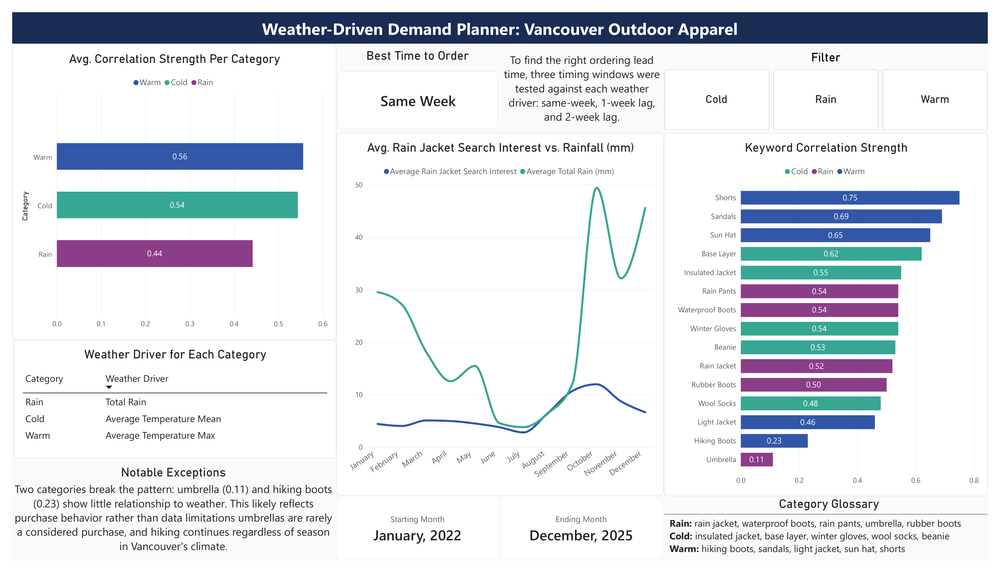

# Weather-Driven Demand Planner: Vancouver Outdoor Apparel

## The Question

Demand planners at outdoor apparel companies constantly face a version of this question:

> **Given upcoming weather patterns, which product categories should we be stocking up on, and when?**

This project answers a scaled-down, real-data version of that question for a single city — Vancouver, BC — using public weather data and Google Trends as a proxy for consumer search demand.

## Pipeline


| Stage                 | Tool                                                         | What Happens                                                                                                                   |
| --------------------- | ------------------------------------------------------------ | ------------------------------------------------------------------------------------------------------------------------------ |
| Data Collection       | OpenWeatherMap, Open-Meteo, Google Trends (pytrends), Python | Pulled 4 years of daily Vancouver weather and weekly search interest for 15 outdoor-apparel keywords                           |
| Validation & Cleaning | MySQL                                                        | Checked for nulls, duplicates, and date misalignment; aggregated daily weather into weekly buckets to match Trends' resolution |
| Analysis              | Python (pandas)                                              | Calculated Pearson correlation between each keyword and its relevant weather driver; tested same-week vs. 1- and 2-week lag    |
| Final Dataset         | MySQL                                                        | Stored results in a summary table                                                                                              |
| Visualization         | Power BI                                                     | Interactive dashboard with category rankings, trend charts, and key findings                                                   |

## Dashboard



The interactive `.pbix` file is in `/dashboard` and can be opened directly in Power BI Desktop. The screenshot above is a static snapshot of the same report.

## Data Sources

- **Weather** — [Open-Meteo](https://open-meteo.com/) (historical daily data, free, no API key required) and [OpenWeatherMap](https://openweathermap.org/) (geocoding). Daily max/min/mean temperature and total rainfall, January 2022 – December 2025.
- **Search interest** — Google Trends via the [pytrends](https://github.com/GeneralMills/pytrends) library. 15 keywords across three categories, geo-scoped to British Columbia.

Google Trends limits requests to 5 keywords at a time and normalizes each request's scores independently, so keywords were split into three batches grouped by the weather condition most likely to drive them — rather than mixed together and compared on raw score, which wouldn't be a valid comparison.

| Category | Keywords                                                          | Weather Driver           |
| -------- | ----------------------------------------------------------------- | ------------------------ |
| Rain     | rain jacket, waterproof boots, rain pants, umbrella, rubber boots | Total rainfall           |
| Cold     | insulated jacket, base layer, winter gloves, wool socks, beanie   | Average mean temperature |
| Warm     | hiking boots, sandals, light jacket, sun hat, shorts              | Average max temperature  |

Because Trends scores are normalized per batch, categories are compared throughout by **correlation strength** (a statistically valid, scale-independent comparison), never by raw search score.

## Key Findings

**Warm-weather gear showed the strongest relationships overall.** `Shorts` (0.75) and `sandals` (0.69) correlate strongly with peak daily temperature, the two clearest signals in the whole dataset.

**Cold-weather gear showed the most consistent response.** Every keyword in the category fell in the -0.48 to -0.62 range against average temperature, with no weak outliers the tightest, most uniform category.

**Rain gear showed moderate, consistent correlation** (~0.50–0.54) across most keywords, with one clear exception: `umbrella` (-0.11) showed almost no relationship to rainfall likely a low-consideration, already-owned item rather than something people shop for in response to rain.

**Timing: same-week, not lagged.** Every one of the 15 keywords showed its strongest relationship in the same week as the weather event, not 1 or 2 weeks later, tested and confirmed across all three categories. This suggests search-driven demand is reactive, not anticipatory: inventory needs to be in place before or as weather hits, not restocked afterward.

**`Hiking_boots` (-0.23)** was the other notable outlier, likely reflecting hiking as a year-round activity in Vancouver rather than one gated by temperature.

## Repo Structure

```
weather-demand-planner/
├── README.md
├── .gitignore
├── .env.example
├── images/
│   ├── pipeline_diagram.png
│   └── dashboard_screenshot.png
├── notebooks/
│   ├── weather_data_collection.ipynb
│   ├── pytrends.ipynb
│   └── sql_connector_and_analysis.ipynb
├── sql_files/
│   ├── dp_data_validation.sql
│   ├── dp_eda.sql
│   └── dp_final_table.sql
├── data/
│   ├── vancouver_weather_daily.csv
│   ├── trends_rain.csv
│   ├── trends_cold.csv
│   ├── trends_warm.csv
│   └── demand_summary.csv
└── dashboard/
    └── demand_planner_dashboard.pbix
```

## Running This Yourself

1. Clone the repo and create a `.env` file in the root (see `.env.example` for the required variables — an OpenWeatherMap API key and your local MySQL credentials).
2. Create a local MySQL database (e.g. `CREATE DATABASE demand_planning_project;`) and update `.env` to match its name.
3. Run the notebooks in `notebooks/` in order — `weather_data_collection.ipynb` → `pytrends.ipynb` — to pull fresh weather and search-interest data, saved as CSVs in `data/`.
4. Import those CSVs into MySQL as raw tables, then run `dp_data_validation.sql` and `dp_eda.sql` to validate, clean, aggregate to weekly, and join the weather and Trends tables.
5. Run `sql_connector_and_analysis.ipynb` to pull the joined tables into pandas, calculate correlations (same-week and lagged), and build `demand_summary.csv`.
6. Import `demand_summary.csv` into MySQL as a new table, then run `dp_final_table.sql` to add the `correlation_strength` (absolute value) column used for ranking.
7. Open `dashboard/demand_planner_dashboard.pbix` in Power BI Desktop and point it at your own MySQL instance.

## Limitations

- **Single city.** The original idea compared multiple Canadian climates; this was narrowed to Vancouver only for depth over breadth.
- **Search interest ≠ sales.** Google Trends measures search behavior, not actual purchases — a useful demand _proxy_, not a direct measure of demand.
- **Weekly resolution.** Google Trends auto-resamples to weekly over a multi-year range, so all analysis sits at weekly, not daily, granularity.
- **Correlation, not causation.** These are statistical associations, not proof that weather directly causes search behavior.

## Why This Project

Built as a portfolio piece connecting SQL, Python, and Power BI into one working analytics pipeline, and modeling the kind of question a demand planning role would ask of real, public data.
